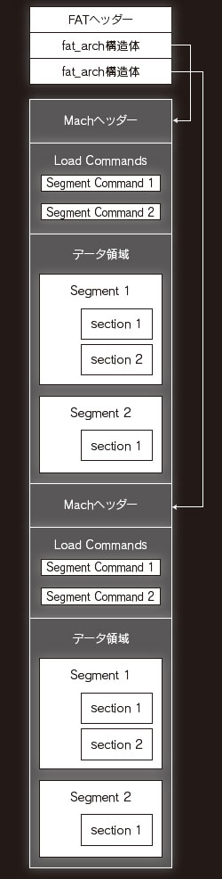

# Universal Bianry Sample

Create Universal 2 Binary

See the [official document](https://developer.apple.com/documentation/xcode/building_a_universal_macos_binary) for more details.

# Requirements

[Xcode-beta 12](https://developer.apple.com/documentation/xcode-release-notes/xcode-12-beta-release-notes)

You should also switch Command Line Tools to Xcode beta.

```bash
$ sudo xcode-select -s /Applications/Xcode-beta.app
```

# How to build

```bash
$ make
```

# Fat Binary Header Structure

Fat Binary has the following structure.

 (https://image.itmedia.co.jp/l/im/enterprise/articles/0711/30/l_tnmacfig5.jpg#_ga=2.209621786.963696107.1593231054-1997665550.1558858244)

## Example

[The hexdump of example file](./universal_app.hexdump) includes:

- Fat Header (includes the offsets to each binary object)
- Binary #0 (x86_x64)
- Binary #1 (AArch64)

```c
// include/mach-o/fat.h

#define FAT_MAGIC       0xcafebabe
#define FAT_CIGAM       0xbebafeca      /* NXSwapLong(FAT_MAGIC) */

struct fat_header {
        uint32_t        magic;          /* FAT_MAGIC or FAT_MAGIC_64 */
        uint32_t        nfat_arch;      /* number of structs that follow */
};

struct fat_arch {
        cpu_type_t      cputype;        /* cpu specifier (int) */
        cpu_subtype_t   cpusubtype;     /* machine specifier (int) */
        uint32_t        offset;         /* file offset to this object file */
        uint32_t        size;           /* size of this object file */
        uint32_t        align;          /* alignment as a power of 2 */
};
```

In this example,

- magic: cafebeba
- nfat_arch: 2
- fat_arch #0
    - cputype: 0x01000007 (CPU_TYPE_X86_64)
    - cpusubtype: 0x3 (might be CPU_SUBTYPE_ANY)
    - offset: 0x4000 (You can find the x86_64 binary object at 0x4000)
    - size: 0x80f0
    - align: 0xe
- fat_arch #1
    - cputype: 0x0100000c (CPU_TYPE_ARM64)
    - cpusubtype: 0x0 (CPU_SUBTYPE_LITTLE_ENDIAN)
    - offset: 0x10000 (You can find the AArch64 binary object at 0x10000)
    - size: 0xc110
    - align: 0xe

# Appendix `cpu_type_t` and `cpu_subtype_t`

You can find the definition of cpu_type_t in `/usr/include/mach/machine.h`

- `cpu_type_t`

```c
/*
 * Capability bits used in the definition of cpu_type.
 */
#define CPU_ARCH_MASK           0xff000000      /* mask for architecture bits */
#define CPU_ARCH_ABI64          0x01000000      /* 64 bit ABI */
#define CPU_ARCH_ABI64_32       0x02000000      /* ABI for 64-bit hardware with 32-bit types; LP32 */

/*
 *	Machine types known by all.
 */

#define CPU_TYPE_ANY            ((cpu_type_t) -1)

#define CPU_TYPE_VAX            ((cpu_type_t) 1)
/* skip				((cpu_type_t) 2)	*/
/* skip				((cpu_type_t) 3)	*/
/* skip				((cpu_type_t) 4)	*/
/* skip				((cpu_type_t) 5)	*/
#define CPU_TYPE_MC680x0        ((cpu_type_t) 6)
#define CPU_TYPE_X86            ((cpu_type_t) 7)
#define CPU_TYPE_I386           CPU_TYPE_X86            /* compatibility */
#define CPU_TYPE_X86_64         (CPU_TYPE_X86 | CPU_ARCH_ABI64)

/* skip CPU_TYPE_MIPS		((cpu_type_t) 8)	*/
/* skip                         ((cpu_type_t) 9)	*/
#define CPU_TYPE_MC98000        ((cpu_type_t) 10)
#define CPU_TYPE_HPPA           ((cpu_type_t) 11)
#define CPU_TYPE_ARM            ((cpu_type_t) 12)
#define CPU_TYPE_ARM64          (CPU_TYPE_ARM | CPU_ARCH_ABI64)
#define CPU_TYPE_ARM64_32       (CPU_TYPE_ARM | CPU_ARCH_ABI64_32)
#define CPU_TYPE_MC88000        ((cpu_type_t) 13)
#define CPU_TYPE_SPARC          ((cpu_type_t) 14)
#define CPU_TYPE_I860           ((cpu_type_t) 15)
/* skip	CPU_TYPE_ALPHA		((cpu_type_t) 16)	*/
/* skip				((cpu_type_t) 17)	*/
#define CPU_TYPE_POWERPC                ((cpu_type_t) 18)
#define CPU_TYPE_POWERPC64              (CPU_TYPE_POWERPC | CPU_ARCH_ABI64)
/* skip				((cpu_type_t) 19)	*/
/* skip				((cpu_type_t) 20 */
/* skip				((cpu_type_t) 21 */
/* skip				((cpu_type_t) 22 */
```

- `cpu_subtype_t`

```c
/*
 * Capability bits used in the definition of cpu_subtype.
 */
#define CPU_SUBTYPE_MASK        0xff000000      /* mask for feature flags */
#define CPU_SUBTYPE_LIB64       0x80000000      /* 64 bit libraries */
#define CPU_SUBTYPE_PTRAUTH_ABI 0x80000000      /* pointer authentication with versioned ABI */

/*
 *      When selecting a slice, ANY will pick the slice with the best
 *      grading for the selected cpu_type_t, unlike the "ALL" subtypes,
 *      which are the slices that can run on any hardware for that cpu type.
 */
#define CPU_SUBTYPE_ANY         ((cpu_subtype_t) -1)

/*
 *	Object files that are hand-crafted to run on any
 *	implementation of an architecture are tagged with
 *	CPU_SUBTYPE_MULTIPLE.  This functions essentially the same as
 *	the "ALL" subtype of an architecture except that it allows us
 *	to easily find object files that may need to be modified
 *	whenever a new implementation of an architecture comes out.
 *
 *	It is the responsibility of the implementor to make sure the
 *	software handles unsupported implementations elegantly.
 */
#define CPU_SUBTYPE_MULTIPLE            ((cpu_subtype_t) -1)
#define CPU_SUBTYPE_LITTLE_ENDIAN       ((cpu_subtype_t) 0)
#define CPU_SUBTYPE_BIG_ENDIAN          ((cpu_subtype_t) 1)
```
